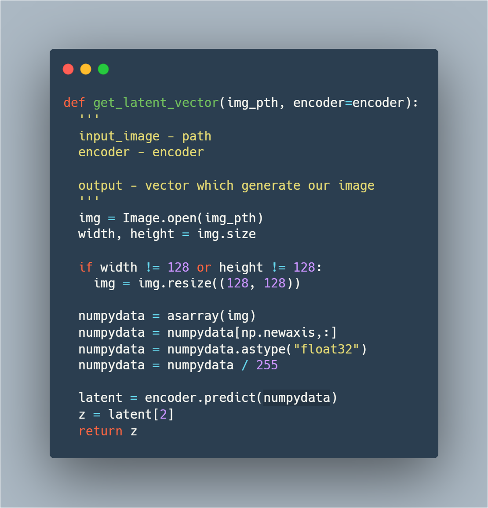
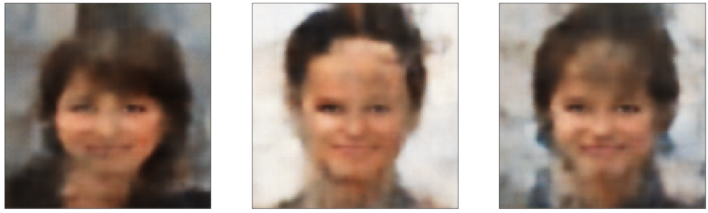
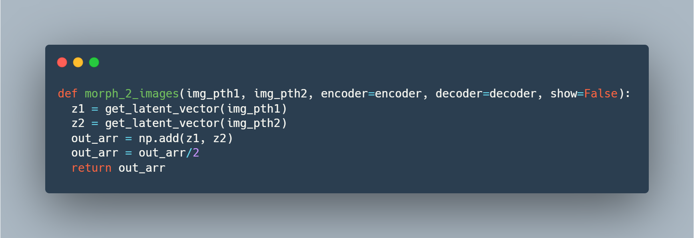
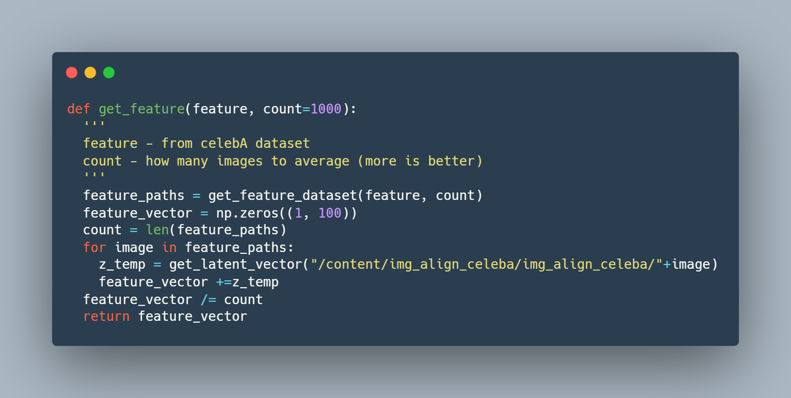
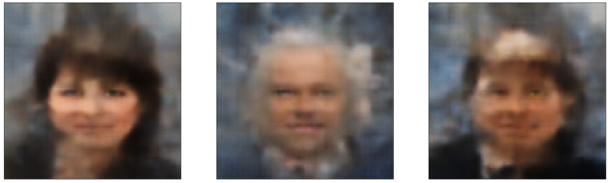
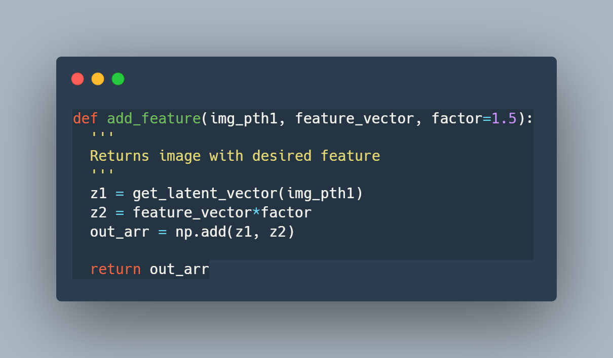

  


# Description

Extract feature vectors from TF Variational Autoencoder
For more info check ipynb

## Embedding in latent space



## Morphing faces



## Feature extraction


## Add feature (e.g. baldness) to image



## TODO

```bash
* Unbias feature vector extraction
```
